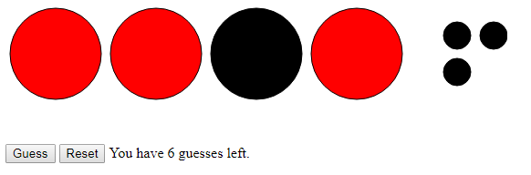

# Mastermind Game in JavaScript

This is a color sequence guessing game implemented in Next.js with TypeScript.

The game chooses a sequence of 4 colors. You have 10 guesses to discover the correct sequence. After each guess, you are given feedback about how many correct colors you have guessed, and how many are in the correct location in the sequence.



## Installing the Game

```
npm install
```

## Running the Game

```
npm run dev
```

## Running the Unit Tests

```
npm run test
```

## Supported Browsers

- Chrome
- Firefox
